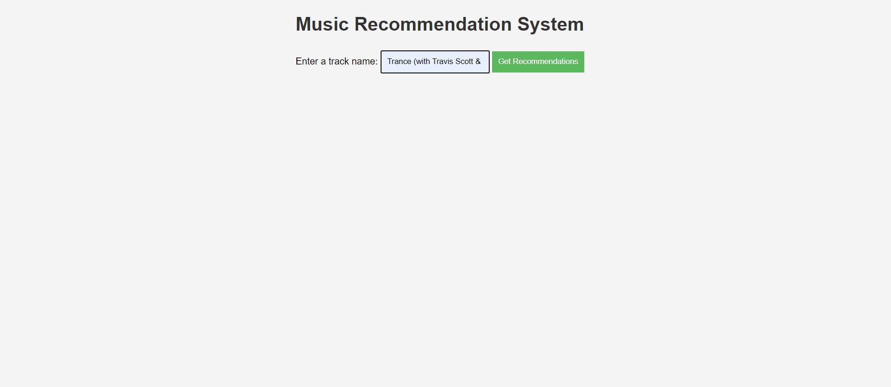
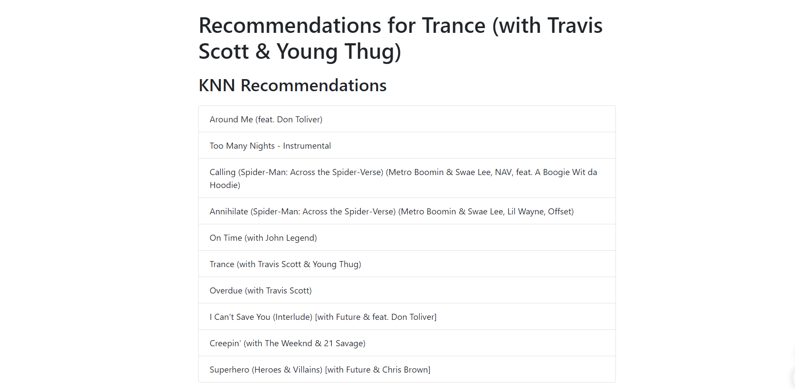
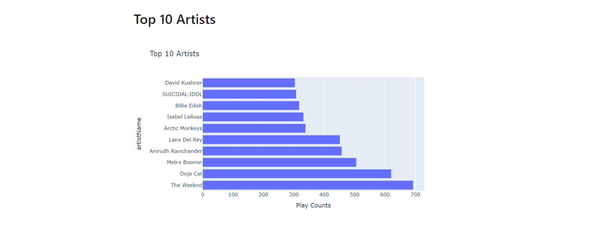

# Music Recommendation System

This project is a music recommendation system that uses both collaborative filtering and content-based filtering to recommend tracks. Additionally, it displays a horizontal bar graph of the top artists based on the streaming history.
#### Note: Data I used is my own spotify data which I downloaded from the app.


## Table of Contents

- [Introduction](#introduction)
- [Features](#features)
- [Installation](#installation)
- [Usage](#usage)
- [File Structure](#file-structure)
- [Technologies Used](#technologies-used)
- [License](#license)

## Introduction

The Music Recommendation System provides personalized music recommendations based on your listening history. It leverages collaborative filtering with k-nearest neighbors (KNN) and content-based filtering using TF-IDF vectorization. The system also visualizes the top artists from the user's listening history.

## Features

- **Collaborative Filtering**: Recommends tracks using k-nearest neighbors based on the listening history.
- **Content-Based Filtering**: Recommends tracks using cosine similarity on TF-IDF vectorized track names.
- **Hybrid Recommendations**: Combines both collaborative and content-based recommendations.
- **Top Artists Visualization**: Displays a horizontal bar graph of the top artists.
  

## Installation

1. **Clone the repository**:
    ```sh
    git clone https://github.com/yourusername/music_recommendation.git
    cd music_recommendation
    ```

2. **Create a virtual environment and activate it**:
    ```sh
    python -m venv venv
    source venv/bin/activate  # On Windows, use `venv\Scripts\activate`
    ```

3. **Install the required packages**:
    ```sh
    pip install -r requirements.txt
    ```

4. **Ensure you have the streaming history files in the `data` directory**:
    Place your streaming history JSON files (e.g., `StreamingHistory_music_0.json`) in the `data` directory.

## Usage

1. **Run the Flask application**:
    ```sh
    python app.py
    ```

2. **Open your web browser** and navigate to `http://127.0.0.1:5000/`.

3. **Enter a track name** in the input field and click on the "Get Recommendations" button to see the recommended tracks and top artists visualization.
4. 
5. 
6. 

## File Structure
music_recommendation/
│
├── app.py # Main Flask application
├── requirements.txt # Required Python packages
├── templates/
│ ├── index.html # Homepage template
│ └── recommendations.html # Recommendations and visualization template
├── data/
│ └── StreamingHistory_music_0.json # Example streaming history file
├── README.md # Project documentation
└── static/
└── style.css # Optional CSS for additional styling

## Technologies Used

- **Python**: Main programming language
- **Flask**: Web framework
- **Pandas**: Data manipulation and analysis
- **scikit-learn**: Machine learning library for collaborative and content-based filtering
- **Plotly**: Library for creating interactive visualizations
- **HTML/CSS**: Frontend templating and styling
- **JavaScript**: Optional, for enhancing interactivity

## License

This project is licensed under the MIT License. See the [LICENSE](LICENSE) file for details.

